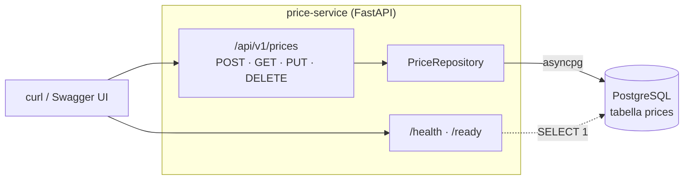
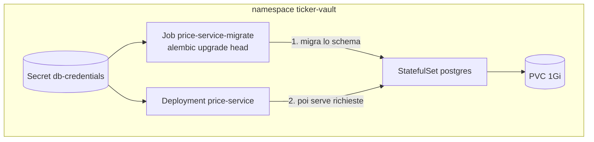

# ticker-vault

[](https://github.com/LorenzoPerrella/ticker-vault/actions/workflows/ci.yml)
[](LICENSE)

API CRUD asincrona per prezzi di titoli finanziari — prototipo da portfolio che
copre l'intero ciclo di uno sviluppo backend moderno: API async tipizzata,
testing a due livelli (unit mockati + integration su Postgres reale),
containerizzazione multi-stage, orchestrazione Kubernetes con Kustomize.

Il processo di pianificazione completo (decisioni prese prima di scrivere
codice, piano dei commit) è in [`plan.md`](plan.md).

## Stack

| Livello | Scelta |
|---|---|
| API | **FastAPI**, async end-to-end |
| Dati | **SQLAlchemy 2.0** (stile typed, async via `asyncpg`) + **Alembic** |
| Database | **PostgreSQL 17** |
| Test | **pytest** — unit (mock) + integration (**testcontainers**, Postgres reale) |
| Container | **Docker** multi-stage |
| Orchestrazione | **Kubernetes** — **Kustomize** (base + overlay dev/prod), `kind` in locale |
| Tooling | **uv**, **ruff**, **mypy** (strict), **pre-commit** |
| CI | **GitHub Actions** — 5 job (lint/type-check, unit, integration, build immagine, validazione manifest k8s) |

## Architettura



Una sessione SQLAlchemy per richiesta HTTP (commit se l'handler completa,
rollback se propaga un'eccezione): il repository fa solo `flush`, mai
`commit`, il confine di transazione resta del chiamante.

In Kubernetes, l'ordine migrazioni-poi-app è una procedura di deploy
documentata, non un hook automatico (nessun Helm/ArgoCD in questo prototipo):



## Decisioni architetturali

| Decisione | Scelta | Perché |
|---|---|---|
| Ingestion dati | API CRUD completa, no fonti esterne | Scope v1 volutamente ristretto: dimostrare lo stack, non integrare provider di mercato |
| Numeri | `Numeric`/`Decimal`, mai `float` | Un prezzo non è mai un valore approssimato |
| SQLAlchemy | 2.0 typed, async (`asyncpg`) | Un solo driver, coerente con FastAPI async end-to-end — anche le migrazioni Alembic usano il template async, non un driver sync parallelo |
| Migrazioni in k8s | `Job` dedicato pre-rollout | Mai eseguite dai pod app: uno schema in mutazione non deve dipendere dal ciclo di vita di un pod che serve richieste |
| Postgres in k8s | `StatefulSet` + `PersistentVolumeClaim` | Trade-off da prototipo — vedi sotto |
| Secrets | `secretGenerator` di Kustomize da un file locale gitignored (mai valori hardcoded) | Standard, riproducibile, nessun segreto in git |
| Auth | Assente | Scope escluso esplicitamente in v1 |

## Struttura del progetto

```
├── pyproject.toml / uv.lock          # uv, dipendenze, config ruff/mypy/pytest
├── .github/workflows/ci.yml          # 5 job CI
├── Dockerfile                        # multi-stage: builder (uv) -> runtime (slim, non-root)
├── docker-compose.yml                # postgres + migrate (one-shot) + app
├── alembic.ini / migrations/         # schema versionato, template async
├── src/price_service/
│   ├── main.py                       # app factory FastAPI
│   ├── config.py                     # Settings (pydantic-settings)
│   ├── deps.py                       # dependency injection: sessione per richiesta
│   ├── db/                           # Base dichiarativa + modello ORM
│   ├── repositories/                 # accesso ai dati, isolato da FastAPI
│   ├── schemas/                      # contratti Pydantic dell'API
│   └── api/                          # router /api/v1/prices, /health, /ready
├── tests/{unit,integration}/
└── k8s/
    ├── base/                         # namespace, postgres, app, migration Job
    └── overlays/{dev,prod}/          # secretGenerator, immagine, replica count
```

## Sviluppo

Richiede [`uv`](https://docs.astral.sh/uv/).

```bash
uv sync                    # crea il virtualenv e installa le dipendenze
uv run pre-commit install  # (opzionale) hook pre-commit locali
```

### Modalità 1 — dev loop locale

```bash
docker compose up -d postgres   # Postgres 17 (default dev già validi, nessun setup richiesto)
uv run alembic upgrade head
uv run uvicorn price_service.main:app --reload
```

→ [http://localhost:8000/docs](http://localhost:8000/docs)

### Modalità 2 — container buildato

```bash
docker compose up --build
```

Build immagine, avvio Postgres, migrazioni (`migrate`, one-shot) e solo dopo
l'app — stessa API su `localhost:8000/docs`, tutto containerizzato.

### Modalità 3 — deploy k8s locale (`kind`)

```bash
kind create cluster --name ticker-vault
docker build -t price-service:local .
kind load docker-image price-service:local --name ticker-vault

cp k8s/overlays/dev/.env.secret.example k8s/overlays/dev/.env.secret  # prima volta
kubectl apply -k k8s/overlays/dev

kubectl -n ticker-vault wait --for=condition=complete job/price-service-migrate --timeout=60s
kubectl -n ticker-vault rollout status deployment/price-service
kubectl -n ticker-vault port-forward svc/price-service 8000:8000
```

→ [http://localhost:8000/docs](http://localhost:8000/docs)

Per un redeploy dopo aver ricostruito l'immagine (stesso tag `:local`, quindi
il testo del manifest non cambia — il Job è immutabile a parità di nome):

```bash
kubectl -n ticker-vault delete job price-service-migrate
kubectl apply -k k8s/overlays/dev
kubectl -n ticker-vault rollout restart deployment/price-service
```

`kubectl kustomize k8s/overlays/prod` è validato in CI ma non pensato per un
deploy reale su questo cluster locale (punta a un'immagine placeholder su un
registry inesistente) — dimostra la struttura dell'overlay (immagine e
credenziali distinte da dev, `replicas: 2`), non un ambiente prod funzionante.

Personalizzare le credenziali locali/dev: copiare l'`.env.secret.example`
pertinente (radice del repo per l'app locale, `k8s/overlays/{dev,prod}/` per
i rispettivi overlay) in `.env.secret` nella stessa cartella — mai committato.

## Testing

```bash
uv run pytest tests/unit         # mock, nessun DB — routing, traduzione errori, paginazione
uv run pytest tests/integration  # Postgres reale via testcontainers — vincoli, precisione Numeric, SQL effettiva
uv run ruff check . && uv run ruff format --check . && uv run mypy
```

I due livelli verificano cose diverse per design: gli unit test isolano la
logica del repository/router da un `AsyncSession` mockata (veloci, non
verificano SQL reale); gli integration test spingono contro un Postgres 17
vero in un container, l'unico modo per verificare che `UNIQUE(symbol,
price_date)` sia davvero applicato dal DB o che `Numeric(18,6)` non perda
precisione in un round-trip.

## API

| Metodo | Path | Descrizione |
|---|---|---|
| `POST` | `/api/v1/prices` | Crea un prezzo — `409` se `(symbol, price_date)` esiste già |
| `GET` | `/api/v1/prices` | Lista, filtri `symbol`/`date_from`/`date_to`, paginazione `limit`/`offset` |
| `GET` | `/api/v1/prices/{id}` | Dettaglio — `404` se assente |
| `PUT` | `/api/v1/prices/{id}` | Update parziale — `404`/`409` |
| `DELETE` | `/api/v1/prices/{id}` | Cancella — `404` se assente |
| `GET` | `/health` | Liveness — non tocca il DB |
| `GET` | `/ready` | Readiness — `503` se il DB non risponde |

Schema interattivo completo su `/docs` una volta avviata l'app.

## Trade-off consapevoli

Scelte fatte deliberatamente per restare alla scala di un prototipo, non per
ignoranza del modo "giusto" in produzione:

- **Postgres StatefulSet+PVC** invece di un servizio managed (RDS/Cloud SQL) —
  qui serve a dimostrare stato persistente in k8s; in produzione backup,
  failover e patching li gestirebbe il servizio managed.
- **Sincronizzazione manuale di `.env.secret`** tra i vari contesti (locale,
  overlay dev, overlay prod) invece di un secret manager centralizzato o un
  operator dedicato (es. External Secrets Operator).
- **Nessuna autenticazione** — scope escluso esplicitamente, non una
  dimenticanza.
- **Job di migrazione con tag immagine mutabile (`:local`) in dev** — un
  redeploy richiede `kubectl delete job` a mano; in produzione si userebbero
  tag immutabili (release/SHA) e un job name univoco per deploy.
- **Nessun hook di ordinamento migrazioni→rollout** (niente Helm/ArgoCD) — la
  sequenza corretta è una procedura documentata (sopra), non automatica.

## Estendibilità futura

Un'eventuale seconda applicazione consumer (es. un batch Airflow) che legga/
scriva sullo stesso Postgres girerebbe nello stesso cluster `kind`, in un
proprio namespace/overlay applicato separatamente, con un proprio `Secret`
generato dalle stesse tre credenziali (`POSTGRES_USER`, `POSTGRES_PASSWORD`,
`POSTGRES_DB`) — non l'host, che cambia legittimamente per contesto. Dettagli
completi in [`plan.md`](plan.md).

## Licenza

[MIT](LICENSE)
